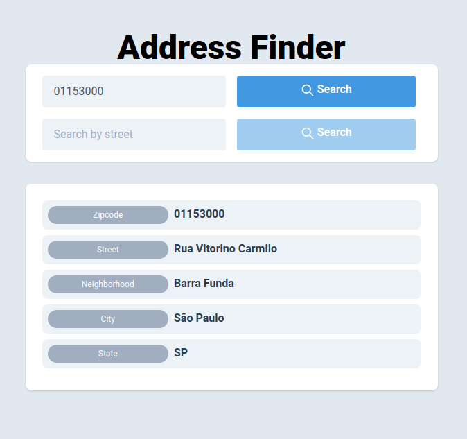

# Address Finder
Laravel + Vue + Tailwind 



## Installation
- Copy ```api/.env.example``` to ```api/.env```

- Run:
  - ```docker-compose up```
  - ```docker-compose exec api composer install```
  - ```docker-compose exec api php artisan key:generate```
  - ```docker-compose exec api php artisan migrate:fresh```
- Access http://localhost:8080


### Notes
- Create API structure:
```
docker-compose run --rm api composer create-project --prefer-dist laravel/laravel .
```
 - Create APP structure:
```
docker-compose run --rm app bash -c "yarn global add @vue/cli && vue create ." 
```